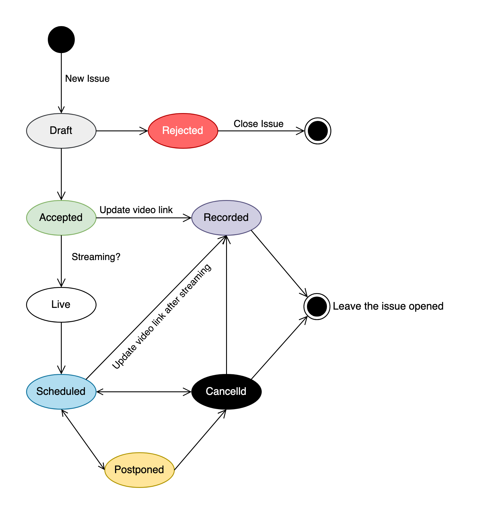

## PgTalk

PgTalk is a channel dedicated to sharing presentations and talks focused on [PostgreSQL](https://github.com/postgres/postgres), providing deep insights into PostgreSQL’s core functionalities, its source code, the extensive ecosystem of tools and extensions that enhance its capabilities.

The repository is managed through GitHub [issues](https://github.com/PgTalk/PgTalk/issues), with each talk represented as a separate issue. The lifecycle of each issue follows the state graph below, and corresponding labels are used to tag each issue accordingly.

